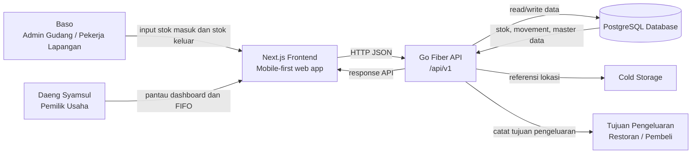
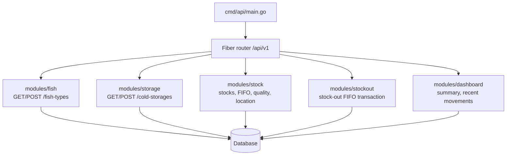
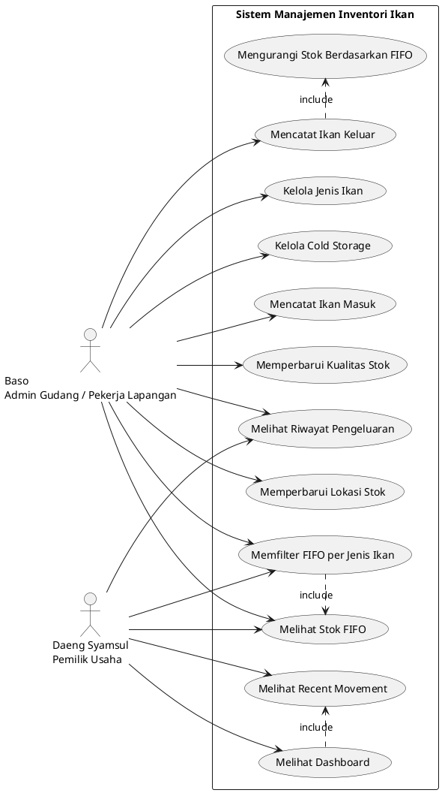
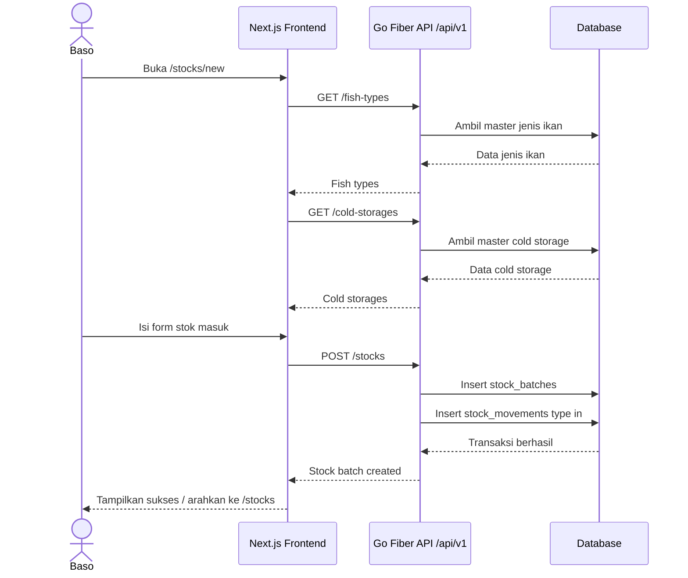
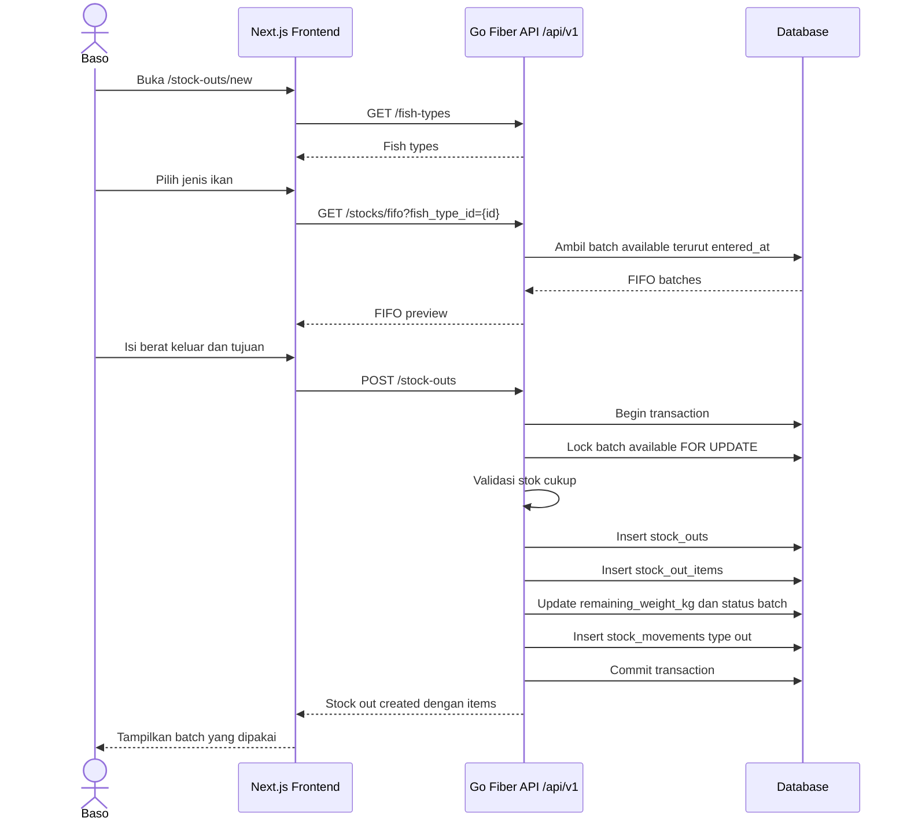

# Diagram Sistem | Ikan't Setop Us

Dokumen ini adalah sumber diagram sistem. File PNG di folder ini adalah artefak visual; jika diagram berubah, update sumber di file ini terlebih dahulu.

Update terakhir: 2026-05-06.

## 1. Context Diagram



## 2. Backend Module Diagram

Backend saat ini dipetakan per modul domain di `apps/api/internal/modules`.



## 3. Use Case Diagram



## 4. ER Diagram

Sumber DBML terpisah juga tersedia di `docs/diagram/diagram_erd.dbml`.

```dbml
Project fish_inventory_fifo {
  database_type: "PostgreSQL"
  Note: '''
  Sistem manajemen inventori ikan berbasis FIFO untuk stok masuk,
  stok keluar, lokasi cold storage, kualitas ikan, dan histori aktivitas stok.
  '''
}

Enum user_role {
  owner
  warehouse_admin
}

Enum fish_quality {
  baik
  sedang
  buruk
}

Enum stock_status {
  available
  depleted
}

Enum stock_movement_type {
  in
  out
  quality_update
  location_update
  adjustment
}

Table users {
  id uuid [pk]
  name varchar(120) [not null]
  role user_role [not null]
  email varchar(120)
  password_hash text
  created_at timestamp [not null]
  updated_at timestamp [not null]
}

Table fish_types {
  id uuid [pk]
  name varchar(100) [not null, unique]
  image_url text
  description text
  created_at timestamp [not null]
  updated_at timestamp [not null]
}

Table cold_storages {
  id uuid [pk]
  name varchar(100) [not null]
  location_label varchar(150)
  description text
  created_at timestamp [not null]
  updated_at timestamp [not null]
}

Table stock_batches {
  id uuid [pk]
  fish_type_id uuid [not null]
  cold_storage_id uuid [not null]
  quality fish_quality [not null]
  initial_weight_kg decimal(10,2) [not null]
  remaining_weight_kg decimal(10,2) [not null]
  entered_at timestamp [not null]
  status stock_status [not null]
  notes text
  created_by uuid
  created_at timestamp [not null]
  updated_at timestamp [not null]
}

Table stock_outs {
  id uuid [pk]
  destination varchar(150) [not null]
  total_weight_kg decimal(10,2) [not null]
  out_at timestamp [not null]
  notes text
  created_by uuid
  created_at timestamp [not null]
  updated_at timestamp [not null]
}

Table stock_out_items {
  id uuid [pk]
  stock_out_id uuid [not null]
  stock_batch_id uuid [not null]
  weight_kg decimal(10,2) [not null]
  created_at timestamp [not null]
}

Table stock_movements {
  id uuid [pk]
  stock_batch_id uuid [not null]
  movement_type stock_movement_type [not null]
  weight_kg decimal(10,2)
  previous_quality fish_quality
  new_quality fish_quality
  previous_cold_storage_id uuid
  new_cold_storage_id uuid
  description text
  created_by uuid
  created_at timestamp [not null]
}

Ref: stock_batches.fish_type_id > fish_types.id
Ref: stock_batches.cold_storage_id > cold_storages.id
Ref: stock_batches.created_by > users.id
Ref: stock_outs.created_by > users.id
Ref: stock_out_items.stock_out_id > stock_outs.id
Ref: stock_out_items.stock_batch_id > stock_batches.id
Ref: stock_movements.stock_batch_id > stock_batches.id
Ref: stock_movements.previous_cold_storage_id > cold_storages.id
Ref: stock_movements.new_cold_storage_id > cold_storages.id
Ref: stock_movements.created_by > users.id
```

## 5. Sequence Diagram - Stock In



## 6. Sequence Diagram - Stock Out FIFO



## 7. Catatan Sinkronisasi

- Endpoint sequence memakai base path `/api/v1`.
- Update kualitas dan lokasi sudah ada di backend, tetapi bukan prioritas halaman frontend MVP.
- Auth dan role user belum diimplementasikan di aplikasi MVP walaupun tabel `users` sudah ada di schema.
